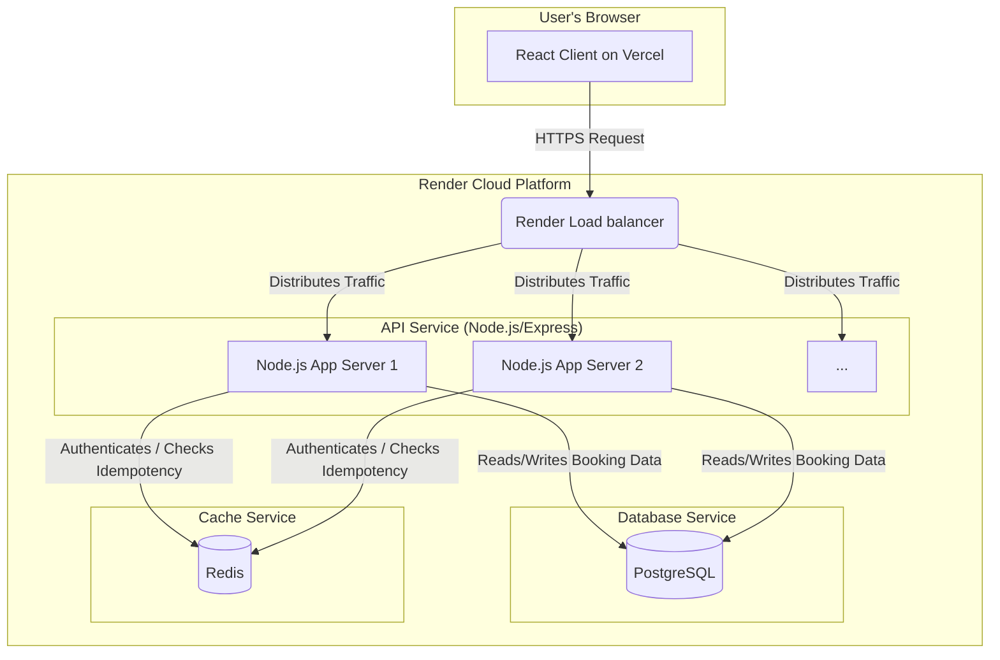

# Movie Booking API: System Documentation

## 1. Introduction
The Movie Booking API is a stateful backend service responsible for managing movies, showtimes, user authentication, and processing concurrent-safe seat bookings. It is designed to be a scalable, secure, and robust REST API for any client-facing application.

## 2. System Architecture
This diagram shows the high-level infrastructure and data flow for the backend, hosted on Render.

## 3. Tech Stack & Key Libraries

| Library | Category | Purpose |
| :--- | :--- | :--- |
| **Node.js** | Runtime | Asynchronous, non-blocking I/O runtime. |
| **Express.js** | Framework | Minimalist web framework for routing and middleware. |
| **PostgreSQL** | Database | Primary relational database for transactional (ACID) integrity. |
| **Knex.js** | ORM/Query Builder | Used for SQL query building and schema migrations. |
| **Redis** | In-Memory Cache | Used for storing idempotency keys for fast lookups. |
| **`jsonwebtoken`** | Authentication | To sign and verify stateless JWTs for auth. |
| **`bcryptjs`** | Security | To hash and compare user passwords securely. |
| **`cors`** | Middleware | To manage Cross-Origin Resource Sharing. |
| **`jest`** | Testing | Test runner for integration tests. |
| **`supertest`** | Testing | To make HTTP requests against the test server. |

## 4. Database Schema

- **`users`**: Stores user credentials.
  - `id`, `name`, `email`, `password_hash`, `created_at`, `updated_at`
- **`movies`**: Stores movie details.
  - `id`, `title`, `description`, `created_at`, `updated_at`
- **`theatres`**: Stores theater locations.
  - `id`, `name`, `location`, `created_at`, `updated_at`
- **`shows`**: Links movies and theaters at a specific time.
  - `id`, `movie_id` (FK to `movies`), `theatre_id` (FK to `theatres`), `start_time`, `created_at`, `updated_at`
- **`seats`**: Represents each seat for a specific show.
  - `id`, `show_id` (FK to `shows`), `row`, `number`, `price`, `status` (`available`, `booked`)
  - **Constraint:** `UNIQUE(show_id, row, number)`
- **`bookings`**: Records a completed transaction.
  - `id`, `user_id` (FK to `users`), `show_id` (FK to `shows`), `seat_id` (FK to `seats`), `booked_at`

## 5. API Endpoints

- `POST /api/auth/register`
- `POST /api/auth/login`
- `GET /api/movies`
- `GET /api/movies/:movieId/shows`
- `GET /api/shows/:showId/seats`
- `POST /api/bookings`
  - **Protected:** Yes (Requires Bearer Token)
  - **Idempotent:** Yes (Requires `Idempotency-Key` header)
  - **Body:** `{ "show_id": 1, "seat_id": 5 }`
